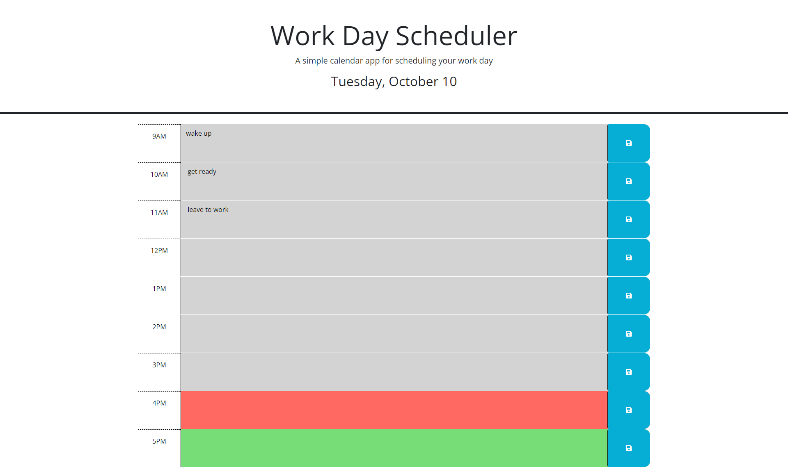

* Description 
 
In this application when ever the user opens the webpage they see a work scheduler with multiple timeblocks that resemble a work day. Depending on what the current time is the timeblock will update. The past will turn into a grey color, present into a red color and future into a green color. When ever you input text and select the save button icon then the text is saved into the local storage. The text saved in the local storage is now displayed in the selected time block even if the user refreshes the page.

* Screenshot

* Link to deployed application 

[Work-Scheduler](https://tmysterz.github.io/work-Schedule-Attemp-Two/)